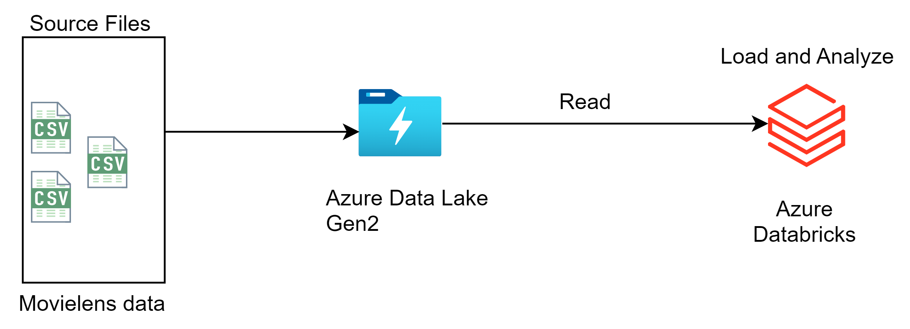

# Analysis-on-MovieLens-DataSet-using-Azure-Databricks
Analysis and Visualisation of MovieLens Dataset using Azure Databricks

## Description
The aim of this project, is to  Extract the data from the Azure Data Lake Storage and load as well as transform data in Azure Databricks using PySpark and Spark SQL

## Getting Started

## Architecture Diagram

## Dataset
- MovieLens Dataset ( https://www.kaggle.com/datasets/grouplens/movielens-20m-dataset )
- The Movielens data zip file is extracted to get the CSV files out of it in two ways: the Databricks local file system(DFS) and the Azure data factory(ADF) copy pipeline

## Services
- Azure Databricks
- Azure Data Lake Storage

## Language
- PySpark
- Spark SQL

## Data Formats
- zip
- CSV
